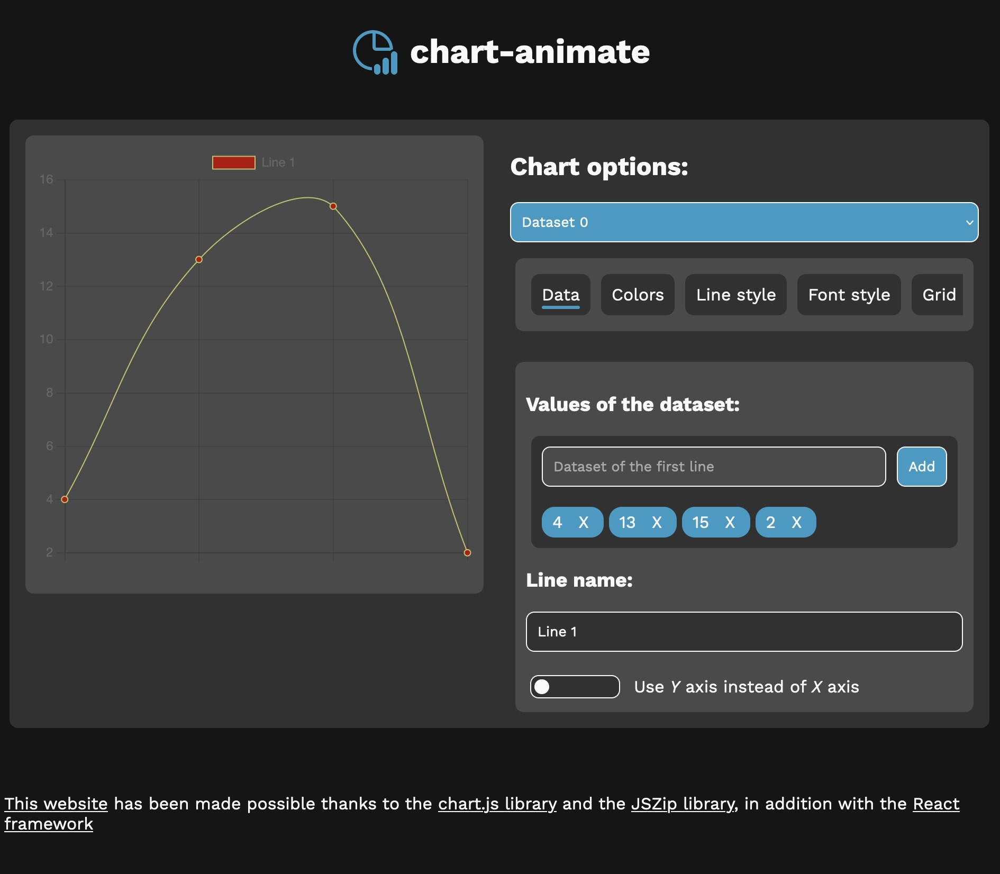

# chart-animate

Create a custom chart using Chart.JS and then export its object or its animation

Try it: https://dinoosauro.github.io/chart-animate/

## Functionality

- Export the chart as a Chart.JS object
- Export the chart animation as a series of PNG image

## Edits

You can edit:

### For each dataset:

- Dataset Values
- Dataset Name
- Line/border colors
- Line width
- Line dashes
- Gaps between nullish values
- Fill color

### For the entire chart:

- Font family
- Font color
- Invert Y and X axis
- Grid color
- Loading animation
- Tension animation
- Names of the X axis
- Minimum/Maximum value of the Y axis
- Aspect ratio
- Chart type
